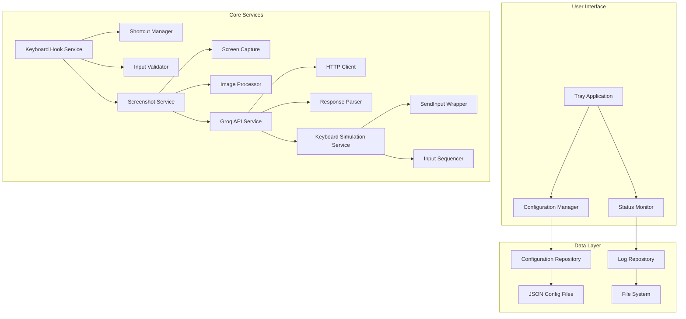

# Interview Assistant Technical Specification

## Project Overview

The Interview Assistant is a Windows background application developed in C# that captures global keyboard shortcuts, takes screenshots, sends them to Groq API for processing, and simulates keyboard input based on API responses. The application is specifically designed to work with Google Chrome browser and must avoid conflicts with other applications.

## Technology Stack

### Core Technologies
- **Language**: C# 12.0+
- **Framework**: .NET 8.0 (Windows Desktop)
- **Architecture**: Windows Forms/WPF for UI (minimal tray application)
- **Background Service**: Windows Service + NotifyIcon for tray management

### Key Libraries
- **Global Hooking**: `System.Windows.Forms` (for low-level keyboard hooks)
- **Screenshot Capture**: `System.Drawing` + `Windows.Graphics.Capture`
- **HTTP Client**: `HttpClient` for Groq API integration
- **Configuration**: `System.Configuration.ConfigurationManager` + JSON serialization
- **Logging**: `Serilog` or `NLog` for structured logging
- **Keyboard Simulation**: `SendInput` API via P/Invoke

## Architecture Overview



## Component Breakdown

### 1. Application Entry Point
- **Main Application**: Windows Service with NotifyIcon fallback
- **Service Manager**: Handles service lifecycle and tray integration
- **Configuration Loader**: Initializes application settings on startup

### 2. Keyboard Hook Service
- **Hook Manager**: Implements `SetWindowsHookEx` for global keyboard monitoring
- **Shortcut Processor**: Detects and validates keyboard combinations
- **Event Queue**: Manages keyboard event processing with proper synchronization

### 3. Screenshot Service
- **Screen Capture**: Uses `Windows.Graphics.Capture` for high-performance screenshots
- **Region Selector**: Optional capability to capture specific screen regions
- **Image Optimizer**: Compresses images for API transmission

### 4. Groq API Service
- **API Client**: Handles HTTP requests to Groq API
- **Authentication**: Manages API key and authentication
- **Response Processing**: Parses API responses and extracts action commands

### 5. Keyboard Simulation Service
- **Input Simulator**: Uses `SendInput` API for reliable keyboard simulation
- **Command Executor**: Processes API response commands and executes them
- **Input Sequencer**: Manages timing and delays between simulated inputs

### 6. Configuration System
- **Configuration Manager**: Handles loading and saving of settings
- **Prompt Repository**: Manages predefined prompts for different scenarios
- **Shortcut Configuration**: Allows customization of keyboard combinations

## Implementation Approach

### 1. Windows Background Application Architecture

**Recommended Approach**: Hybrid Windows Service + NotifyIcon
- **Windows Service**: Ensures the application runs in background without user interaction
- **NotifyIcon**: Provides user interface for configuration and status monitoring
- **Fallback Mechanism**: Service can run without tray icon if needed

**Implementation Details**:
```csharp
public class InterviewAssistantService : ServiceBase
{
    private NotifyIcon _trayIcon;
    private KeyboardHookService _keyboardHook;
    private ScreenshotService _screenshotService;
    private GroqApiService _groqApi;
    private KeyboardSimulationService _keyboardSim;
    
    protected override void OnStart(string[] args)
    {
        InitializeServices();
        StartKeyboardHook();
    }
    
    protected override void OnStop()
    {
        StopKeyboardHook();
        CleanupServices();
    }
}
```

### 2. Global Keyboard Hooking Mechanism

**Recommended Approach**: `SetWindowsHookEx` with WH_KEYBOARD_LL
- **Low-level hook**: Captures all keyboard events system-wide
- **Thread-safe processing**: Uses proper synchronization mechanisms
- **Performance optimization**: Minimal overhead for non-target events

**Implementation Details**:
```csharp
public class KeyboardHookService
{
    private IntPtr _hookId = IntPtr.Zero;
    private readonly object _lockObject = new object();
    private readonly List<KeyboardShortcut> _shortcuts = new List<KeyboardShortcut>();
    
    public void StartHook()
    {
        using Process curProcess = Process.GetCurrentProcess();
        using ProcessModule curModule = curProcess.MainModule;
        _hookId = SetWindowsHookEx(WH_KEYBOARD_LL, LowLevelKeyboardProc, 
            GetModuleHandle(curModule.ModuleName), 0);
    }
    
    private IntPtr LowLevelKeyboardProc(int nCode, IntPtr wParam, IntPtr lParam)
    {
        // Process keyboard events and trigger shortcuts
    }
}
```

### 3. Screenshot Capture Methods

**Recommended Approach**: `Windows.Graphics.Capture` API
- **High performance**: Direct screen capture with minimal overhead
- **Multi-monitor support**: Can capture specific monitors or entire screen
- **Format optimization**: PNG for quality, JPEG for compression

**Implementation Details**:
```csharp
public class ScreenshotService
{
    private readonly GraphicsCaptureSession _captureSession;
    
    public async Task<Bitmap> CaptureScreenAsync()
    {
        using var capture = new GraphicsCaptureSession();
        var surface = await capture.CreateCaptureSurfaceAsync();
        return await surface.CaptureAsync();
    }
    
    public async Task<Bitmap> CaptureRegionAsync(Rectangle region)
    {
        // Capture specific screen region
    }
}
```

### 4. Groq API Integration

**Recommended Approach**: REST API with proper error handling
- **Async HTTP client**: Non-blocking API calls
- **Rate limiting**: Respects API rate limits
- **Retry mechanism**: Handles temporary failures gracefully

**Implementation Details**:
```csharp
public class GroqApiService
{
    private readonly HttpClient _httpClient;
    private readonly string _apiKey;
    
    public async Task<ApiResponse> ProcessScreenshotAsync(Bitmap screenshot, string prompt)
    {
        var base64Image = ConvertToBase64(screenshot);
        var request = new ApiRequest
        {
            Model = "llama-3.1-70b-versatile",
            Messages = new List<Message>
            {
                new Message { Role = "user", Content = prompt + $"\\n\\nImage: {base64Image}" }
            }
        };
        
        return await _httpClient.PostAsJsonAsync("/chat/completions", request);
    }
}
```

### 5. Keyboard Input Simulation

**Recommended Approach**: `SendInput` API via P/Invoke
- **High reliability**: More reliable than `keybd_event`
- **Precise timing**: Better control over input timing
- **Unicode support**: Proper handling of international characters

**Implementation Details**:
```csharp
public class KeyboardSimulationService
{
    [DllImport("user32.dll", SetLastError = true)]
    private static extern uint SendInput(uint nInputs, INPUT[] pInputs, int cbSize);
    
    public async Task SimulateKeyPressAsync(string text)
    {
        foreach (var c in text)
        {
            await SimulateCharacterAsync(c);
            await Task.Delay(50); // Small delay between characters
        }
    }
    
    private async Task SimulateCharacterAsync(char c)
    {
        // Convert character to virtual key and send via SendInput
    }
}
```

### 6. Chrome-Specific Considerations

**Implementation Strategy**:
- **Browser Detection**: Identify Chrome windows and processes
- **Focus Management**: Proper window activation before input simulation
- **Conflict Avoidance**: Use Chrome-safe keyboard combinations
- **Timing Optimization**: Account for Chrome's rendering delays

**Chrome Integration**:
```csharp
public class ChromeIntegrationService
{
    public bool IsChromeActive()
    {
        var chromeProcesses = Process.GetProcessesByName("chrome");
        return chromeProcesses.Length > 0;
    }
    
    public void ActivateChromeWindow()
    {
        // Find and activate Chrome window
    }
}
```

## Configuration Management

### Configuration Structure
```json
{
  "Settings": {
    "KeyboardShortcuts": [
      {
        "Combination": "Ctrl+Shift+I",
        "Description": "Capture screenshot and send to AI",
        "Enabled": true
      }
    ],
    "GroqApi": {
      "ApiKey": "your-api-key",
      "Model": "llama-3.1-70b-versatile",
      "Timeout": 30000
    },
    "Screenshot": {
      "Format": "PNG",
      "Quality": 90,
      "Region": "FullScreen"
    }
  },
  "Prompts": {
    "CodingInterview": "Analyze this code and provide suggestions...",
    "GeneralInterview": "Summarize the content and provide key insights...",
    "TechnicalAssessment": "Evaluate the technical aspects and provide feedback..."
  }
}
```

## Error Handling and Logging

### Error Handling Strategy
- **Graceful degradation**: Application continues working on non-critical errors
- **Retry mechanisms**: Automatic retry for transient failures
- **User feedback**: Clear error messages in tray icon
- **Logging**: Comprehensive logging for debugging

### Logging Implementation
```csharp
public class LoggingService
{
    private readonly ILogger _logger;
    
    public void LogError(Exception ex, string context)
    {
        _logger.Error(ex, "Error in {Context}: {Message}", context, ex.Message);
    }
    
    public void LogApiResponse(ApiResponse response)
    {
        _logger.Information("API Response: {StatusCode}, Duration: {Duration}ms", 
            response.StatusCode, response.Duration);
    }
}
```

## Performance Optimization

### Optimization Strategies
- **Lazy loading**: Services initialized only when needed
- **Connection pooling**: Reuse HTTP connections for API calls
- **Memory management**: Proper disposal of resources and images
- **Threading**: Efficient use of async/await patterns
- **Caching**: Cache frequently used configuration and prompts

### Performance Metrics
- **Memory usage**: Target < 100MB RAM
- **CPU usage**: Target < 5% average CPU
- **Response time**: Target < 2 seconds for screenshot capture
- **API latency**: Target < 5 seconds for Groq API response

## Testing Strategy

### Unit Testing
- **Keyboard hook testing**: Mock keyboard events
- **Screenshot service testing**: Test image capture and processing
- **API service testing**: Mock HTTP responses
- **Configuration testing**: Validate configuration loading and validation

### Integration Testing
- **End-to-end workflow**: Test complete capture → API → simulation flow
- **Chrome integration**: Test with actual Chrome browser
- **Performance testing**: Measure resource usage and response times
- **Error scenarios**: Test various failure conditions

### User Acceptance Testing
- **Shortcut validation**: Test all configured keyboard combinations
- **Chrome compatibility**: Test with different Chrome versions
- **Real-world scenarios**: Test in actual interview environments
- **User feedback**: Collect and incorporate user experience feedback

## Potential Challenges and Solutions

### 1. Keyboard Hook Conflicts
**Challenge**: Global keyboard hooks can conflict with other applications
**Solution**: 
- Use low-level hook with minimal processing
- Implement priority handling for Chrome windows
- Provide configuration to avoid conflicting shortcuts

### 2. Chrome Input Simulation
**Challenge**: Chrome may block or delay simulated input
**Solution**:
- Use proper window activation techniques
- Implement timing delays for Chrome rendering
- Test with different Chrome security settings

### 3. API Rate Limiting
**Challenge**: Groq API rate limits may cause delays
**Solution**:
- Implement request queuing and throttling
- Provide user feedback on API limits
- Cache responses when possible

### 4. Performance Issues
**Challenge**: Screen capture and processing may impact performance
**Solution**:
- Optimize image compression and format
- Implement background processing
- Provide performance monitoring

### 5. Security Concerns
**Challenge**: Handling API keys and sensitive data
**Solution**:
- Secure storage of configuration files
- Encrypted communication with API
- Proper error message sanitization

## Implementation Roadmap

### Phase 1: Core Infrastructure (Weeks 1-2)
- Set up project structure and dependencies
- Implement basic Windows Service with tray icon
- Create configuration management system

### Phase 2: Keyboard and Screenshot (Weeks 3-4)
- Implement global keyboard hooking
- Create screenshot capture functionality
- Develop basic Chrome integration

### Phase 3: API Integration (Weeks 5-6)
- Implement Groq API client
- Create response processing system
- Add error handling and logging

### Phase 4: Input Simulation (Weeks 7-8)
- Implement keyboard simulation service
- Add timing and sequencing logic
- Test with Chrome browser

### Phase 5: Optimization and Testing (Weeks 9-10)
- Performance optimization
- Comprehensive testing
- User experience refinement

## Deployment and Maintenance

### Installation Package
- **Windows Installer**: MSI package for easy deployment
- **Service Registration**: Proper Windows service installation
- **Auto-start**: Configure to start with Windows
- **Update mechanism**: Built-in update functionality

### Monitoring and Maintenance
- **Health monitoring**: Service status and performance metrics
- **Log rotation**: Automatic log file management
- **Configuration updates**: Remote configuration capability
- **User support**: Documentation and troubleshooting guide

## Conclusion

This technical specification provides a comprehensive blueprint for the Interview Assistant application. The architecture balances performance, reliability, and user experience while addressing the specific requirements for Chrome integration and global keyboard handling. The modular design allows for easy extension and maintenance, while the testing strategy ensures robust functionality in real-world scenarios.